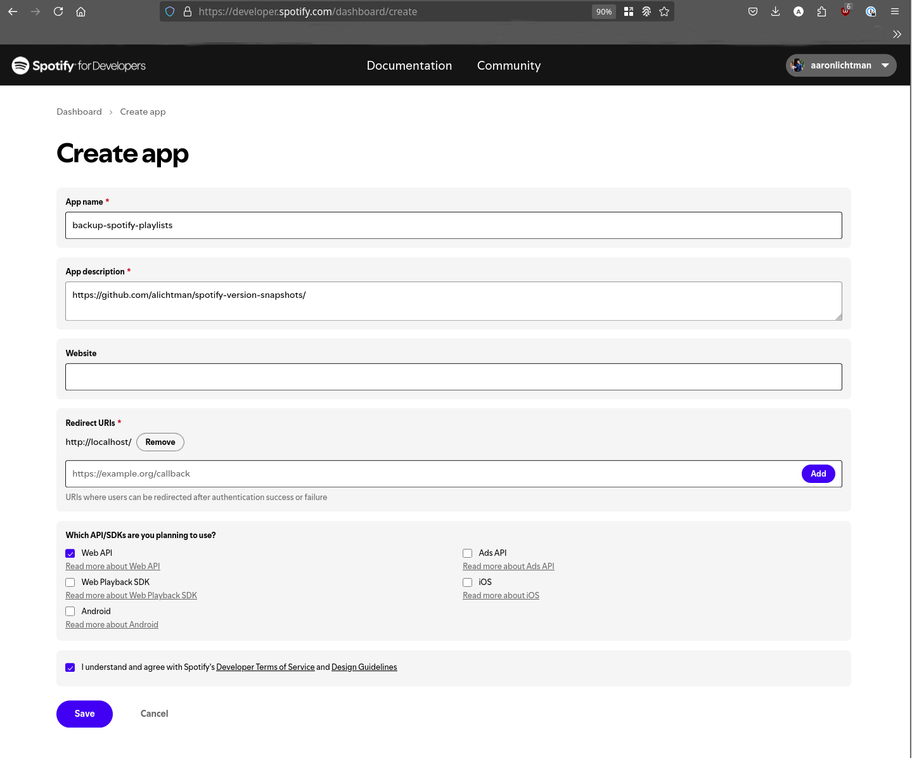

# `spotify-snapshot`

Easily snapshot (and schedule repeated snapshots of) the state of your `Spotify` library / playlists / etc, and store it in version control.

## Why?

- **Most important:** If Spotify ever disappears or has a mass dataloss event, you'll have a current backup of your music library.
- **Less important:** You can track your Spotify world as it evolves over time (and use `git` tooling to analyze it).

> [!WARNING]  
> This tool is limited by the [Spotify API](https://developer.spotify.com/documentation/web-api/reference/get-users-saved-albums) and [`spotipy`](https://github.com/spotipy-dev/spotipy/). For example, it can not access "Spotify Wrapped" playlists, or playlists generated for you by Spotify.

## Quickstart

```bash
$ git clone git@github.com:alichtman/spotify-snapshot.git
$ cd spotify-snapshot
$ pipx install .
$ spotify_snapshot --install
```

## Output Structure

<details>
  <summary>
    <code>$ python3 -m spotify_snapshot</code>
  </summary>

    ```bash
    spotify-snapshot on  main [$!] via 🐍 v3.12.9 (spotify-snapshot) took 6m5s
    09:39:57 PM ✗ python3 -m spotify_snapshot
    2025-02-20 21:39:58.732 | INFO     | __main__:main:143 - *** RUNNING IN PROD MODE ***
    2025-02-20 21:39:58.732 | INFO     | spotify_snapshot.spotify:create_spotify_client:269 - Creating Spotify client...
    2025-02-20 21:39:58.733 | INFO     | spotify_snapshot.spotify:create_spotify_client:295 - Successfully created Spotify client!
    2025-02-20 21:39:58.735 | INFO     | spotify_snapshot.gitutils:setup_git_repo_if_needed:72 - Found existing repo at /home/alichtman/.local/share/spotify-snapshots
    2025-02-20 21:39:58.738 | INFO     | __main__:main:158 - No specific backup option selected. Backing up all data...
    2025-02-20 21:39:58.738 | INFO     | spotify_snapshot.spotify:get_liked_songs:190 - Getting liked songs...
    2025-02-20 21:39:59.336 | INFO     | spotify_snapshot.spotify:_fetch_paginated_tracks:144 - Fetched 50 / 3350 tracks
    2025-02-20 21:40:00.365 | INFO     | spotify_snapshot.spotify:_fetch_paginated_tracks:144 - Fetched 100 / 3350 tracks
    2025-02-20 21:40:01.384 | INFO     | spotify_snapshot.spotify:_fetch_paginated_tracks:144 - Fetched 150 / 3350 tracks
    2025-02-20 21:40:02.312 | INFO     | spotify_snapshot.spotify:_fetch_paginated_tracks:144 - Fetched 200 / 3350 tracks
    ...
    2025-02-20 21:41:04.363 | INFO     | spotify_snapshot.spotify:_fetch_paginated_tracks:144 - Fetched 3350 / 3350 tracks
    2025-02-20 21:41:04.363 | INFO     | spotify_snapshot.outputfileutils:write_to_file:38 - Writing to /home/alichtman/.local/share/spotify-snapshots/liked_songs.tsv
    2025-02-20 21:41:04.380 | INFO     | spotify_snapshot.spotify:write_liked_songs_to_git_repo:337 - Wrote 3350 liked songs to /home/alichtman/.local/share/spotify-snapshots/liked_songs.tsv
    2025-02-20 21:41:04.769 | INFO     | spotify_snapshot.spotify:get_saved_albums:219 - Fetched 7 albums
    2025-02-20 21:41:04.769 | INFO     | spotify_snapshot.outputfileutils:write_to_file:38 - Writing to /home/alichtman/.local/share/spotify-snapshots/saved_albums.tsv
    2025-02-20 21:41:04.769 | INFO     | spotify_snapshot.spotify:write_saved_albums_to_git_repo:354 - Wrote 7 albums to /home/alichtman/.local/share/spotify-snapshots/saved_albums.tsv
    2025-02-20 21:41:05.076 | INFO     | spotify_snapshot.spotify:get_playlists:240 - Fetching 61 playlists...
    2025-02-20 21:41:05.076 | INFO     | spotify_snapshot.spotify:get_playlists:244 - Fetched 50 playlists
    2025-02-20 21:41:05.893 | INFO     | spotify_snapshot.spotify:get_playlists:244 - Fetched 11 playlists
    2025-02-20 21:41:05.894 | INFO     | spotify_snapshot.outputfileutils:write_to_file:38 - Writing to /home/alichtman/.local/share/spotify-snapshots/playlists.tsv
    2025-02-20 21:41:05.894 | INFO     | spotify_snapshot.spotify:get_tracks_from_playlist:201 - Backing up playlist: My 2024 Playlist in a Bottle
    2025-02-20 21:41:06.076 | INFO     | spotify_snapshot.spotify:_fetch_paginated_tracks:144 - Fetched 3 / 3 tracks
    2025-02-20 21:41:06.076 | INFO     | spotify_snapshot.outputfileutils:write_to_file:38 - Writing to /home/alichtman/.local/share/spotify-snapshots/playlists/My 2024 Playlist in a Bottle (69Rzh9wlxx4MHRMb25zybw).tsv
    2025-02-20 21:41:06.076 | INFO     | spotify_snapshot.spotify:get_tracks_from_playlist:201 - Backing up playlist: Racey
    2025-02-20 21:41:06.303 | INFO     | spotify_snapshot.spotify:_fetch_paginated_tracks:144 - Fetched 5 / 5 tracks
    2025-02-20 21:41:06.304 | INFO     | spotify_snapshot.outputfileutils:write_to_file:38 - Writing to /home/alichtman/.local/share/spotify-snapshots/playlists/Racey (5s1Lpk2icnVwU2J7ywEH86).tsv
    2025-02-20 21:41:06.304 | INFO     | spotify_snapshot.spotify:get_tracks_from_playlist:201 - Backing up playlist: House / Trance
    2025-02-20 21:41:06.509 | INFO     | spotify_snapshot.spotify:_fetch_paginated_tracks:144 - Fetched 5 / 5 tracks
    2025-02-20 21:41:06.510 | INFO     | spotify_snapshot.outputfileutils:write_to_file:38 - Writing to /home/alichtman/.local/share/spotify-snapshots/playlists/House ∕ Trance (6ABX9g1jOSjzXKQwdIQD97).tsv
    2025-02-20 21:41:06.510 | INFO     | spotify_snapshot.spotify:get_tracks_from_playlist:201 - Backing up playlist: no gear, no falls
    2025-02-20 21:41:06.712 | INFO     | spotify_snapshot.spotify:_fetch_paginated_tracks:144 - Fetched 17 / 17 tracks
    2025-02-20 21:41:06.713 | INFO     | spotify_snapshot.outputfileutils:write_to_file:38 - Writing to /home/alichtman/.local/share/spotify-snapshots/playlists/no gear, no falls (4m0cEmQC3plDQsyGLiNI5u).tsv
    2025-02-20 21:41:06.713 | INFO     | spotify_snapshot.spotify:get_tracks_from_playlist:201 - Backing up playlist: Highs and lows (aaron)
    2025-02-20 21:41:07.123 | INFO     | spotify_snapshot.spotify:_fetch_paginated_tracks:144 - Fetched 33 / 33 tracks
    2025-02-20 21:41:07.123 | INFO     | spotify_snapshot.outputfileutils:write_to_file:38 - Writing to /home/alichtman/.local/share/spotify-snapshots/playlists/Highs and lows (aaron) (2M9lU4qsmsGZ2I4urRnzE0).tsv
    2025-02-20 21:41:07.123 | INFO     | spotify_snapshot.spotify:get_tracks_from_playlist:201 - Backing up playlist: Sex + Drugs
    2025-02-20 21:41:07.532 | INFO     | spotify_snapshot.spotify:_fetch_paginated_tracks:144 - Fetched 39 / 39 tracks
    2025-02-20 21:41:07.532 | INFO     | spotify_snapshot.outputfileutils:write_to_file:38 - Writing to /home/alichtman/.local/share/spotify-snapshots/playlists/Sex + Drugs (2Gt90Gg8y4RSZg8qwI5fSr).tsv
    2025-02-20 21:41:07.533 | INFO     | spotify_snapshot.spotify:get_tracks_from_playlist:201 - Backing up playlist: Wired In
    2025-02-20 21:41:07.839 | INFO     | spotify_snapshot.spotify:_fetch_paginated_tracks:144 - Fetched 30 / 30 tracks
    2025-02-20 21:41:07.840 | INFO     | spotify_snapshot.outputfileutils:write_to_file:38 - Writing to /home/alichtman/.local/share/spotify-snapshots/playlists/Wired In (4Gg8oTRQXhtLmMeji9uW9G).tsv
    2025-02-20 21:41:07.840 | INFO     | spotify_snapshot.spotify:get_tracks_from_playlist:201 - Backing up playlist: Local Files Sync'd Playlist
    2025-02-20 21:41:08.044 | INFO     | spotify_snapshot.spotify:_fetch_paginated_tracks:144 - Fetched 11 / 11 tracks
    2025-02-20 21:41:08.044 | INFO     | spotify_snapshot.outputfileutils:write_to_file:38 - Writing to /home/alichtman/.local/share/spotify-snapshots/playlists/Local Files Sync'd Playlist (4K6s7a4bDZNrKQA4L3lTBQ).tsv
    2025-02-20 21:41:08.044 | INFO     | spotify_snapshot.spotify:get_tracks_from_playlist:201 - Backing up playlist: Synthwave
    2025-02-20 21:41:08.150 | INFO     | spotify_snapshot.spotify:_fetch_paginated_tracks:144 - Fetched 1 / 1 tracks
    2025-02-20 21:41:08.151 | INFO     | spotify_snapshot.outputfileutils:write_to_file:38 - Writing to /home/alichtman/.local/share/spotify-snapshots/playlists/Synthwave (4lcFpE97tLyxkYl3ZKQi88).tsv
    2025-02-20 21:41:08.151 | INFO     | spotify_snapshot.spotify:get_tracks_from_playlist:201 - Backing up playlist: Relax
    2025-02-20 21:41:08.317 | INFO     | spotify_snapshot.spotify:_fetch_paginated_tracks:144 - Fetched 11 / 11 tracks
    2025-02-20 21:41:08.317 | INFO     | spotify_snapshot.outputfileutils:write_to_file:38 - Writing to /home/alichtman/.local/share/spotify-snapshots/playlists/Relax (29NGHVJlntvh8AmtJjmXyL).tsv
    2025-02-20 21:41:08.318 | INFO     | spotify_snapshot.spotify:get_tracks_from_playlist:201 - Backing up playlist: Tidalwave
    2025-02-20 21:41:08.556 | INFO     | spotify_snapshot.spotify:_fetch_paginated_tracks:144 - Fetched 23 / 23 tracks
    2025-02-20 21:41:08.557 | INFO     | spotify_snapshot.outputfileutils:write_to_file:38 - Writing to /home/alichtman/.local/share/spotify-snapshots/playlists/Tidalwave (5CP41EnK4Vna7kMiDg0Nnr).tsv
    2025-02-20 21:41:08.557 | INFO     | spotify_snapshot.spotify:get_tracks_from_playlist:201 - Backing up playlist: Lucy
    2025-02-20 21:41:08.869 | INFO     | spotify_snapshot.spotify:_fetch_paginated_tracks:144 - Fetched 50 / 57 tracks
    2025-02-20 21:41:09.581 | INFO     | spotify_snapshot.spotify:_fetch_paginated_tracks:144 - Fetched 57 / 57 tracks
    2025-02-20 21:41:09.581 | INFO     | spotify_snapshot.outputfileutils:write_to_file:38 - Writing to /home/alichtman/.local/share/spotify-snapshots/playlists/Lucy (6F6Evtt5svqIeQcK7cqmUl).tsv
    2025-02-20 21:41:09.582 | INFO     | spotify_snapshot.spotify:get_tracks_from_playlist:201 - Backing up playlist: Non-Basic
    2025-02-20 21:41:09.990 | INFO     | spotify_snapshot.spotify:_fetch_paginated_tracks:144 - Fetched 50 / 158 tracks
    2025-02-20 21:41:10.810 | INFO     | spotify_snapshot.spotify:_fetch_paginated_tracks:144 - Fetched 100 / 158 tracks
    2025-02-20 21:41:11.628 | INFO     | spotify_snapshot.spotify:_fetch_paginated_tracks:144 - Fetched 150 / 158 tracks
    2025-02-20 21:41:12.331 | INFO     | spotify_snapshot.spotify:_fetch_paginated_tracks:144 - Fetched 158 / 158 tracks
    2025-02-20 21:41:12.331 | INFO     | spotify_snapshot.outputfileutils:write_to_file:38 - Writing to /home/alichtman/.local/share/spotify-snapshots/playlists/Non-Basic (4UDdBwVpzFYCwqXYmiGAf3).tsv
    2025-02-20 21:41:12.332 | INFO     | spotify_snapshot.spotify:get_tracks_from_playlist:201 - Backing up playlist: Favorites
    2025-02-20 21:41:12.653 | INFO     | spotify_snapshot.spotify:_fetch_paginated_tracks:144 - Fetched 50 / 117 tracks
    2025-02-20 21:41:13.471 | INFO     | spotify_snapshot.spotify:_fetch_paginated_tracks:144 - Fetched 100 / 117 tracks
    2025-02-20 21:41:14.189 | INFO     | spotify_snapshot.spotify:_fetch_paginated_tracks:144 - Fetched 117 / 117 tracks
    2025-02-20 21:41:14.189 | INFO     | spotify_snapshot.outputfileutils:write_to_file:38 - Writing to /home/alichtman/.local/share/spotify-snapshots/playlists/Favorites (0a02LXqBmOewE6yGY7bMj6).tsv
    2025-02-20 21:41:14.190 | INFO     | spotify_snapshot.spotify:get_tracks_from_playlist:201 - Backing up playlist: My Shazam Tracks
    2025-02-20 21:41:14.700 | INFO     | spotify_snapshot.spotify:_fetch_paginated_tracks:144 - Fetched 50 / 147 tracks
    2025-02-20 21:41:15.627 | INFO     | spotify_snapshot.spotify:_fetch_paginated_tracks:144 - Fetched 100 / 147 tracks
    2025-02-20 21:41:16.545 | INFO     | spotify_snapshot.spotify:_fetch_paginated_tracks:144 - Fetched 147 / 147 tracks
    2025-02-20 21:41:16.545 | INFO     | spotify_snapshot.outputfileutils:write_to_file:38 - Writing to /home/alichtman/.local/share/spotify-snapshots/playlists/My Shazam Tracks (2rO3n86sN9LETUL6zQVosJ).tsv
    2025-02-20 21:41:16.546 | INFO     | spotify_snapshot.spotify:get_tracks_from_playlist:201 - Backing up playlist: Melanphoria
    2025-02-20 21:41:16.852 | INFO     | spotify_snapshot.spotify:_fetch_paginated_tracks:144 - Fetched 30 / 30 tracks
    2025-02-20 21:41:16.853 | INFO     | spotify_snapshot.outputfileutils:write_to_file:38 - Writing to /home/alichtman/.local/share/spotify-snapshots/playlists/Melanphoria (5mpnluiwgM2QqbX9eaerOB).tsv
    2025-02-20 21:41:16.853 | INFO     | spotify_snapshot.spotify:get_tracks_from_playlist:201 - Backing up playlist: Phonk
    2025-02-20 21:41:17.056 | INFO     | spotify_snapshot.spotify:_fetch_paginated_tracks:144 - Fetched 11 / 11 tracks
    2025-02-20 21:41:17.056 | INFO     | spotify_snapshot.outputfileutils:write_to_file:38 - Writing to /home/alichtman/.local/share/spotify-snapshots/playlists/Phonk (5rq5Ku3hP2cin52tJcXQ4S).tsv
    2025-02-20 21:41:17.056 | INFO     | spotify_snapshot.spotify:get_tracks_from_playlist:201 - Backing up playlist: Boat
    2025-02-20 21:41:17.363 | INFO     | spotify_snapshot.spotify:_fetch_paginated_tracks:144 - Fetched 26 / 26 tracks
    2025-02-20 21:41:17.363 | INFO     | spotify_snapshot.outputfileutils:write_to_file:38 - Writing to /home/alichtman/.local/share/spotify-snapshots/playlists/Boat (4ePbBaTVMqigMa52l21U64).tsv
    2025-02-20 21:41:17.363 | INFO     | spotify_snapshot.spotify:get_tracks_from_playlist:201 - Backing up playlist: To Process
    2025-02-20 21:41:17.567 | INFO     | spotify_snapshot.spotify:_fetch_paginated_tracks:144 - Fetched 17 / 17 tracks
    2025-02-20 21:41:17.568 | INFO     | spotify_snapshot.outputfileutils:write_to_file:38 - Writing to /home/alichtman/.local/share/spotify-snapshots/playlists/To Process (2TldDLE2JEuudU6uvxGjQT).tsv
    2025-02-20 21:41:17.568 | INFO     | spotify_snapshot.spotify:get_tracks_from_playlist:201 - Backing up playlist: Downhill Snow (Ski / Snowboard)
    2025-02-20 21:41:17.977 | INFO     | spotify_snapshot.spotify:_fetch_paginated_tracks:144 - Fetched 48 / 48 tracks
    2025-02-20 21:41:17.978 | INFO     | spotify_snapshot.outputfileutils:write_to_file:38 - Writing to /home/alichtman/.local/share/spotify-snapshots/playlists/Downhill Snow (Ski ∕ Snowboard) (7u1WLwW45PYQt6Injuqoc5).tsv
    2025-02-20 21:41:17.978 | INFO     | spotify_snapshot.spotify:get_tracks_from_playlist:201 - Backing up playlist: Psychelectrica
    2025-02-20 21:41:18.286 | INFO     | spotify_snapshot.spotify:_fetch_paginated_tracks:144 - Fetched 23 / 23 tracks
    2025-02-20 21:41:18.286 | INFO     | spotify_snapshot.outputfileutils:write_to_file:38 - Writing to /home/alichtman/.local/share/spotify-snapshots/playlists/Psychelectrica (354OZfAypkpGUxxrn96vDR).tsv
    2025-02-20 21:41:18.286 | INFO     | spotify_snapshot.spotify:get_tracks_from_playlist:201 - Backing up playlist: War Drums
    2025-02-20 21:41:18.694 | INFO     | spotify_snapshot.spotify:_fetch_paginated_tracks:144 - Fetched 50 / 65 tracks
    2025-02-20 21:41:19.410 | INFO     | spotify_snapshot.spotify:_fetch_paginated_tracks:144 - Fetched 65 / 65 tracks
    2025-02-20 21:41:19.410 | INFO     | spotify_snapshot.outputfileutils:write_to_file:38 - Writing to /home/alichtman/.local/share/spotify-snapshots/playlists/War Drums (5MyV6denJwna1WFDxdDdf0).tsv
    2025-02-20 21:41:19.411 | INFO     | spotify_snapshot.spotify:get_tracks_from_playlist:201 - Backing up playlist: System Collapse
    2025-02-20 21:41:19.616 | INFO     | spotify_snapshot.spotify:_fetch_paginated_tracks:144 - Fetched 17 / 17 tracks
    2025-02-20 21:41:19.616 | INFO     | spotify_snapshot.outputfileutils:write_to_file:38 - Writing to /home/alichtman/.local/share/spotify-snapshots/playlists/System Collapse (0EdbeHVCvj4zIRz4vEttsT).tsv
    2025-02-20 21:41:19.616 | INFO     | spotify_snapshot.spotify:get_tracks_from_playlist:201 - Backing up playlist: Art of Silence
    2025-02-20 21:41:19.752 | INFO     | spotify_snapshot.spotify:_fetch_paginated_tracks:144 - Fetched 7 / 7 tracks
    2025-02-20 21:41:19.753 | INFO     | spotify_snapshot.outputfileutils:write_to_file:38 - Writing to /home/alichtman/.local/share/spotify-snapshots/playlists/Art of Silence (77dhMXTsHBrmKRBgGumbTV).tsv
    2025-02-20 21:41:19.753 | INFO     | spotify_snapshot.spotify:get_tracks_from_playlist:201 - Backing up playlist: For the girls with good taste in music
    2025-02-20 21:41:19.990 | INFO     | spotify_snapshot.spotify:_fetch_paginated_tracks:144 - Fetched 23 / 23 tracks
    2025-02-20 21:41:19.991 | INFO     | spotify_snapshot.outputfileutils:write_to_file:38 - Writing to /home/alichtman/.local/share/spotify-snapshots/playlists/For the girls with good taste in music (1fWtBPg8DSKhXwzeIvaXVc).tsv
    2025-02-20 21:41:19.991 | INFO     | spotify_snapshot.spotify:get_tracks_from_playlist:201 - Backing up playlist: Dexter
    2025-02-20 21:41:20.230 | INFO     | spotify_snapshot.spotify:_fetch_paginated_tracks:144 - Fetched 13 / 13 tracks
    2025-02-20 21:41:20.231 | INFO     | spotify_snapshot.outputfileutils:write_to_file:38 - Writing to /home/alichtman/.local/share/spotify-snapshots/playlists/Dexter (7qMZnZG7Xfohllm0cxDr2U).tsv
    2025-02-20 21:41:20.231 | INFO     | spotify_snapshot.spotify:get_tracks_from_playlist:201 - Backing up playlist: Hiking
    2025-02-20 21:41:20.538 | INFO     | spotify_snapshot.spotify:_fetch_paginated_tracks:144 - Fetched 28 / 28 tracks
    2025-02-20 21:41:20.538 | INFO     | spotify_snapshot.outputfileutils:write_to_file:38 - Writing to /home/alichtman/.local/share/spotify-snapshots/playlists/Hiking (7yE3nH4rQGo9R3XrI31Ayi).tsv
    2025-02-20 21:41:20.539 | INFO     | spotify_snapshot.spotify:get_tracks_from_playlist:201 - Backing up playlist: it's 4am; the phone rings. THE VOID. you let it go to voicemail.
    2025-02-20 21:41:20.845 | INFO     | spotify_snapshot.spotify:_fetch_paginated_tracks:144 - Fetched 50 / 57 tracks
    2025-02-20 21:41:21.562 | INFO     | spotify_snapshot.spotify:_fetch_paginated_tracks:144 - Fetched 57 / 57 tracks
    2025-02-20 21:41:21.562 | INFO     | spotify_snapshot.outputfileutils:write_to_file:38 - Writing to /home/alichtman/.local/share/spotify-snapshots/playlists/it's 4am; the phone rings. THE VOID. you let it go to voicemail. (2lPLSPfGm5zAEU7u3eKb1M).tsv
    2025-02-20 21:41:21.563 | INFO     | spotify_snapshot.spotify:get_tracks_from_playlist:201 - Backing up playlist: Shower
    2025-02-20 21:41:21.772 | INFO     | spotify_snapshot.spotify:_fetch_paginated_tracks:144 - Fetched 10 / 10 tracks
    2025-02-20 21:41:21.772 | INFO     | spotify_snapshot.outputfileutils:write_to_file:38 - Writing to /home/alichtman/.local/share/spotify-snapshots/playlists/Shower (1x7379j4D4NEHHTfzTNKKS).tsv
    2025-02-20 21:41:21.772 | INFO     | spotify_snapshot.spotify:get_tracks_from_playlist:201 - Backing up playlist: Ket
    2025-02-20 21:41:21.970 | INFO     | spotify_snapshot.spotify:_fetch_paginated_tracks:144 - Fetched 8 / 8 tracks
    2025-02-20 21:41:21.971 | INFO     | spotify_snapshot.outputfileutils:write_to_file:38 - Writing to /home/alichtman/.local/share/spotify-snapshots/playlists/Ket (7Fx2onlEIUfwAtEWR3jZqY).tsv
    2025-02-20 21:41:21.971 | INFO     | spotify_snapshot.spotify:get_tracks_from_playlist:201 - Backing up playlist: Some Lines Aren’t Meant To Be Crossed (but you are)
    2025-02-20 21:41:22.483 | INFO     | spotify_snapshot.spotify:_fetch_paginated_tracks:144 - Fetched 50 / 87 tracks
    2025-02-20 21:41:23.302 | INFO     | spotify_snapshot.spotify:_fetch_paginated_tracks:144 - Fetched 87 / 87 tracks
    2025-02-20 21:41:23.302 | INFO     | spotify_snapshot.outputfileutils:write_to_file:38 - Writing to /home/alichtman/.local/share/spotify-snapshots/playlists/Some Lines Aren’t Meant To Be Crossed (but you are) (5PUANwB7Lfw0fgTW4U5eeX).tsv
    2025-02-20 21:41:23.303 | INFO     | spotify_snapshot.spotify:get_tracks_from_playlist:201 - Backing up playlist: Workout
    2025-02-20 21:41:23.712 | INFO     | spotify_snapshot.spotify:_fetch_paginated_tracks:144 - Fetched 50 / 277 tracks
    2025-02-20 21:41:24.531 | INFO     | spotify_snapshot.spotify:_fetch_paginated_tracks:144 - Fetched 100 / 277 tracks
    2025-02-20 21:41:25.350 | INFO     | spotify_snapshot.spotify:_fetch_paginated_tracks:144 - Fetched 150 / 277 tracks
    2025-02-20 21:41:26.375 | INFO     | spotify_snapshot.spotify:_fetch_paginated_tracks:144 - Fetched 200 / 277 tracks
    2025-02-20 21:41:27.196 | INFO     | spotify_snapshot.spotify:_fetch_paginated_tracks:144 - Fetched 250 / 277 tracks
    2025-02-20 21:41:28.014 | INFO     | spotify_snapshot.spotify:_fetch_paginated_tracks:144 - Fetched 277 / 277 tracks
    2025-02-20 21:41:28.014 | INFO     | spotify_snapshot.outputfileutils:write_to_file:38 - Writing to /home/alichtman/.local/share/spotify-snapshots/playlists/Workout (3tCFzeIVJA6Ab00YmbEGxN).tsv
    2025-02-20 21:41:28.016 | INFO     | spotify_snapshot.spotify:get_tracks_from_playlist:201 - Backing up playlist: Forward
    2025-02-20 21:41:28.320 | INFO     | spotify_snapshot.spotify:_fetch_paginated_tracks:144 - Fetched 25 / 25 tracks
    2025-02-20 21:41:28.320 | INFO     | spotify_snapshot.outputfileutils:write_to_file:38 - Writing to /home/alichtman/.local/share/spotify-snapshots/playlists/Forward (2t3irFKXC0mmQQw2ak0UcJ).tsv
    2025-02-20 21:41:28.321 | INFO     | spotify_snapshot.spotify:get_tracks_from_playlist:201 - Backing up playlist: Just Press Submit
    2025-02-20 21:41:28.717 | INFO     | spotify_snapshot.spotify:_fetch_paginated_tracks:144 - Fetched 50 / 50 tracks
    2025-02-20 21:41:28.718 | INFO     | spotify_snapshot.outputfileutils:write_to_file:38 - Writing to /home/alichtman/.local/share/spotify-snapshots/playlists/Just Press Submit (6bemWPZrM7yc8tG4BnLlOE).tsv
    2025-02-20 21:41:28.718 | INFO     | spotify_snapshot.spotify:get_tracks_from_playlist:201 - Backing up playlist: Lift Heavy Things
    2025-02-20 21:41:28.944 | INFO     | spotify_snapshot.spotify:_fetch_paginated_tracks:144 - Fetched 28 / 28 tracks
    2025-02-20 21:41:28.945 | INFO     | spotify_snapshot.outputfileutils:write_to_file:38 - Writing to /home/alichtman/.local/share/spotify-snapshots/playlists/Lift Heavy Things (6fy7Gg1UlUBUfMMeUFF10X).tsv
    2025-02-20 21:41:28.945 | INFO     | spotify_snapshot.spotify:get_tracks_from_playlist:201 - Backing up playlist: for singing with the windows down
    2025-02-20 21:41:29.207 | INFO     | spotify_snapshot.spotify:_fetch_paginated_tracks:144 - Fetched 34 / 34 tracks
    2025-02-20 21:41:29.207 | INFO     | spotify_snapshot.outputfileutils:write_to_file:38 - Writing to /home/alichtman/.local/share/spotify-snapshots/playlists/for singing with the windows down (4xAJffcjlZNvjWo62pqu8K).tsv
    2025-02-20 21:41:29.207 | INFO     | spotify_snapshot.spotify:get_tracks_from_playlist:201 - Backing up playlist: Vibrant
    2025-02-20 21:41:29.456 | INFO     | spotify_snapshot.spotify:_fetch_paginated_tracks:144 - Fetched 24 / 24 tracks
    2025-02-20 21:41:29.457 | INFO     | spotify_snapshot.outputfileutils:write_to_file:38 - Writing to /home/alichtman/.local/share/spotify-snapshots/playlists/Vibrant (0jdelyL70gI7ZEKfIlPhXz).tsv
    2025-02-20 21:41:29.457 | INFO     | spotify_snapshot.spotify:get_tracks_from_playlist:201 - Backing up playlist: My Forever Favorites
    2025-02-20 21:41:29.596 | INFO     | spotify_snapshot.spotify:_fetch_paginated_tracks:144 - Fetched 5 / 5 tracks
    2025-02-20 21:41:29.596 | INFO     | spotify_snapshot.outputfileutils:write_to_file:38 - Writing to /home/alichtman/.local/share/spotify-snapshots/playlists/My Forever Favorites (6JMxMeAPDrtUOvnKExX5TI).tsv
    2025-02-20 21:41:29.597 | INFO     | spotify_snapshot.spotify:get_tracks_from_playlist:201 - Backing up playlist: Lucid
    2025-02-20 21:41:29.755 | INFO     | spotify_snapshot.spotify:_fetch_paginated_tracks:144 - Fetched 19 / 19 tracks
    2025-02-20 21:41:29.756 | INFO     | spotify_snapshot.outputfileutils:write_to_file:38 - Writing to /home/alichtman/.local/share/spotify-snapshots/playlists/Lucid (4pSqTMgEM9uEOp109hO2P1).tsv
    2025-02-20 21:41:29.756 | INFO     | spotify_snapshot.spotify:get_tracks_from_playlist:201 - Backing up playlist: This Playlist Is Not About A Girl
    2025-02-20 21:41:30.083 | INFO     | spotify_snapshot.spotify:_fetch_paginated_tracks:144 - Fetched 50 / 60 tracks
    2025-02-20 21:41:30.880 | INFO     | spotify_snapshot.spotify:_fetch_paginated_tracks:144 - Fetched 60 / 60 tracks
    2025-02-20 21:41:30.880 | INFO     | spotify_snapshot.outputfileutils:write_to_file:38 - Writing to /home/alichtman/.local/share/spotify-snapshots/playlists/This Playlist Is Not About A Girl (6xx9XP4MXJ0jR4HpOA99Lp).tsv
    2025-02-20 21:41:30.881 | INFO     | spotify_snapshot.spotify:get_tracks_from_playlist:201 - Backing up playlist: Eyes Open
    2025-02-20 21:41:31.188 | INFO     | spotify_snapshot.spotify:_fetch_paginated_tracks:144 - Fetched 50 / 155 tracks
    2025-02-20 21:41:32.120 | INFO     | spotify_snapshot.spotify:_fetch_paginated_tracks:144 - Fetched 100 / 155 tracks
    2025-02-20 21:41:33.030 | INFO     | spotify_snapshot.spotify:_fetch_paginated_tracks:144 - Fetched 150 / 155 tracks
    2025-02-20 21:41:33.753 | INFO     | spotify_snapshot.spotify:_fetch_paginated_tracks:144 - Fetched 155 / 155 tracks
    2025-02-20 21:41:33.753 | INFO     | spotify_snapshot.outputfileutils:write_to_file:38 - Writing to /home/alichtman/.local/share/spotify-snapshots/playlists/Eyes Open (5NP3BBS1kMlqqh6B8JKd1E).tsv
    2025-02-20 21:41:33.754 | INFO     | spotify_snapshot.spotify:get_tracks_from_playlist:201 - Backing up playlist: Alive
    2025-02-20 21:41:33.957 | INFO     | spotify_snapshot.spotify:_fetch_paginated_tracks:144 - Fetched 17 / 17 tracks
    2025-02-20 21:41:33.958 | INFO     | spotify_snapshot.outputfileutils:write_to_file:38 - Writing to /home/alichtman/.local/share/spotify-snapshots/playlists/Alive (0Fel7tbPSXjKArGYLkdX28).tsv
    2025-02-20 21:41:33.958 | INFO     | spotify_snapshot.spotify:get_tracks_from_playlist:201 - Backing up playlist: You.
    2025-02-20 21:41:34.259 | INFO     | spotify_snapshot.spotify:_fetch_paginated_tracks:144 - Fetched 30 / 30 tracks
    2025-02-20 21:41:34.259 | INFO     | spotify_snapshot.outputfileutils:write_to_file:38 - Writing to /home/alichtman/.local/share/spotify-snapshots/playlists/You.  (0JMhuCK3SatswVi8nq5eUi).tsv
    2025-02-20 21:41:34.260 | INFO     | spotify_snapshot.spotify:get_tracks_from_playlist:201 - Backing up playlist: how to: make a child
    2025-02-20 21:41:34.566 | INFO     | spotify_snapshot.spotify:_fetch_paginated_tracks:144 - Fetched 50 / 58 tracks
    2025-02-20 21:41:35.282 | INFO     | spotify_snapshot.spotify:_fetch_paginated_tracks:144 - Fetched 58 / 58 tracks
    2025-02-20 21:41:35.283 | INFO     | spotify_snapshot.outputfileutils:write_to_file:38 - Writing to /home/alichtman/.local/share/spotify-snapshots/playlists/how to: make a child (51DtEkQcfpKsrCA1DbibBn).tsv
    2025-02-20 21:41:35.283 | INFO     | spotify_snapshot.spotify:get_tracks_from_playlist:201 - Backing up playlist: Dazed
    2025-02-20 21:41:35.487 | INFO     | spotify_snapshot.spotify:_fetch_paginated_tracks:144 - Fetched 12 / 12 tracks
    2025-02-20 21:41:35.487 | INFO     | spotify_snapshot.outputfileutils:write_to_file:38 - Writing to /home/alichtman/.local/share/spotify-snapshots/playlists/Dazed (4RShCqsnMwydNrxsmf1rW7).tsv
    2025-02-20 21:41:35.488 | INFO     | spotify_snapshot.spotify:get_tracks_from_playlist:201 - Backing up playlist: Vibrations, of the Good-Ass Variety
    2025-02-20 21:41:35.795 | INFO     | spotify_snapshot.spotify:_fetch_paginated_tracks:144 - Fetched 21 / 21 tracks
    2025-02-20 21:41:35.795 | INFO     | spotify_snapshot.outputfileutils:write_to_file:38 - Writing to /home/alichtman/.local/share/spotify-snapshots/playlists/Vibrations, of the Good-Ass Variety (5mkv4B5czN8JDADaOXLafF).tsv
    2025-02-20 21:41:35.796 | INFO     | spotify_snapshot.spotify:get_tracks_from_playlist:201 - Backing up playlist: VARIETY (not the magazine)
    2025-02-20 21:41:36.116 | INFO     | spotify_snapshot.spotify:_fetch_paginated_tracks:144 - Fetched 50 / 81 tracks
    2025-02-20 21:41:36.923 | INFO     | spotify_snapshot.spotify:_fetch_paginated_tracks:144 - Fetched 81 / 81 tracks
    2025-02-20 21:41:36.923 | INFO     | spotify_snapshot.outputfileutils:write_to_file:38 - Writing to /home/alichtman/.local/share/spotify-snapshots/playlists/VARIETY (not the magazine) (38ChADOJmpmLNrOsLQnGRe).tsv
    2025-02-20 21:41:36.924 | INFO     | spotify_snapshot.spotify:get_tracks_from_playlist:201 - Backing up playlist: Jai Paul Vibes
    2025-02-20 21:41:37.126 | INFO     | spotify_snapshot.spotify:_fetch_paginated_tracks:144 - Fetched 9 / 9 tracks
    2025-02-20 21:41:37.126 | INFO     | spotify_snapshot.outputfileutils:write_to_file:38 - Writing to /home/alichtman/.local/share/spotify-snapshots/playlists/Jai Paul Vibes (1hZUuOTffqwETitYF18opl).tsv
    2025-02-20 21:41:37.127 | INFO     | spotify_snapshot.spotify:get_tracks_from_playlist:201 - Backing up playlist: Club
    2025-02-20 21:41:37.536 | INFO     | spotify_snapshot.spotify:_fetch_paginated_tracks:144 - Fetched 46 / 46 tracks
    2025-02-20 21:41:37.537 | INFO     | spotify_snapshot.outputfileutils:write_to_file:38 - Writing to /home/alichtman/.local/share/spotify-snapshots/playlists/Club (2QevsFo0WvtRjmgfbNWgk2).tsv
    2025-02-20 21:41:37.537 | INFO     | spotify_snapshot.spotify:get_tracks_from_playlist:201 - Backing up playlist: an emerging :D
    2025-02-20 21:41:37.844 | INFO     | spotify_snapshot.spotify:_fetch_paginated_tracks:144 - Fetched 28 / 28 tracks
    2025-02-20 21:41:37.844 | INFO     | spotify_snapshot.outputfileutils:write_to_file:38 - Writing to /home/alichtman/.local/share/spotify-snapshots/playlists/an emerging :D (5Avu0wyqTdiYLpM8LbUiFN).tsv
    2025-02-20 21:41:37.845 | INFO     | spotify_snapshot.spotify:get_tracks_from_playlist:201 - Backing up playlist: Outrun
    2025-02-20 21:41:37.964 | INFO     | spotify_snapshot.spotify:_fetch_paginated_tracks:144 - Fetched 7 / 7 tracks
    2025-02-20 21:41:37.964 | INFO     | spotify_snapshot.outputfileutils:write_to_file:38 - Writing to /home/alichtman/.local/share/spotify-snapshots/playlists/Outrun (7HGV163Gdvw0bGknU396NP).tsv
    2025-02-20 21:41:37.965 | INFO     | spotify_snapshot.spotify:get_tracks_from_playlist:201 - Backing up playlist: Slightly Techno I Guess
    2025-02-20 21:41:38.253 | INFO     | spotify_snapshot.spotify:_fetch_paginated_tracks:144 - Fetched 40 / 40 tracks
    2025-02-20 21:41:38.253 | INFO     | spotify_snapshot.outputfileutils:write_to_file:38 - Writing to /home/alichtman/.local/share/spotify-snapshots/playlists/Slightly Techno I Guess (51YgjXwxYK11Z1rEQbeyK5).tsv
    2025-02-20 21:41:38.254 | INFO     | spotify_snapshot.spotify:get_tracks_from_playlist:201 - Backing up playlist: X
    2025-02-20 21:41:38.561 | INFO     | spotify_snapshot.spotify:_fetch_paginated_tracks:144 - Fetched 41 / 41 tracks
    2025-02-20 21:41:38.561 | INFO     | spotify_snapshot.outputfileutils:write_to_file:38 - Writing to /home/alichtman/.local/share/spotify-snapshots/playlists/X (4R1K5dFVNJBoMdOH74ai9Z).tsv
    2025-02-20 21:41:38.562 | INFO     | spotify_snapshot.spotify:get_tracks_from_playlist:201 - Backing up playlist: Empty
    2025-02-20 21:41:38.765 | INFO     | spotify_snapshot.spotify:_fetch_paginated_tracks:144 - Fetched 20 / 20 tracks
    2025-02-20 21:41:38.765 | INFO     | spotify_snapshot.outputfileutils:write_to_file:38 - Writing to /home/alichtman/.local/share/spotify-snapshots/playlists/Empty (4M4pySkDMZyV1I00puwr2B).tsv
    2025-02-20 21:41:38.765 | INFO     | spotify_snapshot.spotify:get_tracks_from_playlist:201 - Backing up playlist: Liked from Radio
    2025-02-20 21:41:38.970 | INFO     | spotify_snapshot.spotify:_fetch_paginated_tracks:144 - Fetched 11 / 11 tracks
    2025-02-20 21:41:38.970 | INFO     | spotify_snapshot.outputfileutils:write_to_file:38 - Writing to /home/alichtman/.local/share/spotify-snapshots/playlists/Liked from Radio (5kc4T9yxIvFUCJgDXGpudT).tsv
    2025-02-20 21:41:38.970 | INFO     | spotify_snapshot.spotify:get_tracks_from_playlist:201 - Backing up playlist: 15yo Angst (you should rly delete this)
    2025-02-20 21:41:39.277 | INFO     | spotify_snapshot.spotify:_fetch_paginated_tracks:144 - Fetched 33 / 33 tracks
    2025-02-20 21:41:39.278 | INFO     | spotify_snapshot.outputfileutils:write_to_file:38 - Writing to /home/alichtman/.local/share/spotify-snapshots/playlists/15yo Angst (you should rly delete this) (4excLf228sXGYGlQIgkJhk).tsv
    2025-02-20 21:41:39.278 | INFO     | spotify_snapshot.spotify:get_tracks_from_playlist:201 - Backing up playlist: Studying
    2025-02-20 21:41:39.586 | INFO     | spotify_snapshot.spotify:_fetch_paginated_tracks:144 - Fetched 39 / 39 tracks
    2025-02-20 21:41:39.586 | INFO     | spotify_snapshot.outputfileutils:write_to_file:38 - Writing to /home/alichtman/.local/share/spotify-snapshots/playlists/Studying (2e4G4b80vzTSUAfkTWFaRs).tsv
    2025-02-20 21:41:39.586 | INFO     | spotify_snapshot.spotify:get_tracks_from_playlist:201 - Backing up playlist: Dad's Music
    2025-02-20 21:41:39.891 | INFO     | spotify_snapshot.spotify:_fetch_paginated_tracks:144 - Fetched 27 / 27 tracks
    2025-02-20 21:41:39.891 | INFO     | spotify_snapshot.outputfileutils:write_to_file:38 - Writing to /home/alichtman/.local/share/spotify-snapshots/playlists/Dad's Music (54R3epAVBTxNrYwHS4x6bS).tsv
    2025-02-20 21:41:39.892 | INFO     | spotify_snapshot.spotify:get_tracks_from_playlist:201 - Backing up playlist: Air on.
    2025-02-20 21:41:40.172 | INFO     | spotify_snapshot.spotify:_fetch_paginated_tracks:144 - Fetched 30 / 30 tracks
    2025-02-20 21:41:40.172 | INFO     | spotify_snapshot.outputfileutils:write_to_file:38 - Writing to /home/alichtman/.local/share/spotify-snapshots/playlists/Air on. (2tEPtZosfnq90IkBk2KhUe).tsv
    2025-02-20 21:41:40.172 | INFO     | spotify_snapshot.spotify:get_tracks_from_playlist:201 - Backing up playlist: Whoa
    2025-02-20 21:41:40.505 | INFO     | spotify_snapshot.spotify:_fetch_paginated_tracks:144 - Fetched 50 / 173 tracks
    2025-02-20 21:41:41.428 | INFO     | spotify_snapshot.spotify:_fetch_paginated_tracks:144 - Fetched 100 / 173 tracks
    2025-02-20 21:41:42.247 | INFO     | spotify_snapshot.spotify:_fetch_paginated_tracks:144 - Fetched 150 / 173 tracks
    2025-02-20 21:41:42.943 | INFO     | spotify_snapshot.spotify:_fetch_paginated_tracks:144 - Fetched 173 / 173 tracks
    2025-02-20 21:41:42.944 | INFO     | spotify_snapshot.outputfileutils:write_to_file:38 - Writing to /home/alichtman/.local/share/spotify-snapshots/playlists/Whoa (5oWvHQZ8Qpzm1uoQ67gcdm).tsv
    2025-02-20 21:41:42.945 | INFO     | spotify_snapshot.spotify:get_tracks_from_playlist:201 - Backing up playlist: Formal
    2025-02-20 21:41:43.168 | INFO     | spotify_snapshot.spotify:_fetch_paginated_tracks:144 - Fetched 11 / 11 tracks
    2025-02-20 21:41:43.169 | INFO     | spotify_snapshot.outputfileutils:write_to_file:38 - Writing to /home/alichtman/.local/share/spotify-snapshots/playlists/Formal (0y8T4cKUKG729IvsPYmGIL).tsv
    2025-02-20 21:41:43.169 | INFO     | spotify_snapshot.spotify:write_playlists_to_git_repo:405 - Successfully backed up 61 playlists
    2025-02-20 21:41:43.188 | INFO     | spotify_snapshot.gitutils:commit_files:136 - No changes to commit
    Push changes to remote repository? [y/N] (N): y
    2025-02-20 21:42:04.582 | INFO | spotify_snapshot.gitutils:maybe_git_push:398 - Pushing changes to remote...
    2025-02-20 21:42:05.803 | INFO | spotify_snapshot.gitutils:maybe_git_push:431 - Successfully pushed changes to https://github.com/alichtman/spotify-snapshots!
    ```

</details>

This will produce a `spotify-snapshots` repo in your `$XDG_DATA_HOME/spotify-snapshots` directory, with a structure like:

```
├──  playlists
│   ├──  'Air on. (2tEPtZosfnq90IkBk2KhUe).tsv'
│   ├──  'Alive (0Fel7tbPSXjKArGYLkdX28).tsv'
│   ├──  'an emerging :D (5Avu0wyqTdiYLpM8LbUiFN).tsv'
│   ├──  'Art of Silence (77dhMXTsHBrmKRBgGumbTV).tsv'
│   ├──  'Boat (4ePbBaTVMqigMa52l21U64).tsv'
│   ├──  'Club (2QevsFo0WvtRjmgfbNWgk2).tsv'
│   ├──  "Dad's Music (54R3epAVBTxNrYwHS4x6bS).tsv"
│   ├──  'Dazed (4RShCqsnMwydNrxsmf1rW7).tsv'
│   ├──  'Downhill Snow (Ski ∕ Snowboard) (7u1WLwW45PYQt6Injuqoc5).tsv'
│   ├──  'Empty (4M4pySkDMZyV1I00puwr2B).tsv'
│   ├──  'Eyes Open (5NP3BBS1kMlqqh6B8JKd1E).tsv'
│   ├──  'Favorites (0a02LXqBmOewE6yGY7bMj6).tsv'
│   ├──  'for singing with the windows down (4xAJffcjlZNvjWo62pqu8K).tsv'
│   ├──  'For the girls with good taste in music (1fWtBPg8DSKhXwzeIvaXVc).tsv'
│   ├──  'Formal (0y8T4cKUKG729IvsPYmGIL).tsv'
│   ├──  'Forward (2t3irFKXC0mmQQw2ak0UcJ).tsv'
│   ├──  'Highs and lows (aaron) (2M9lU4qsmsGZ2I4urRnzE0).tsv'
│   ├──  'Hiking (7yE3nH4rQGo9R3XrI31Ayi).tsv'
│   ├──  'House ∕ Trance (6ABX9g1jOSjzXKQwdIQD97).tsv'
│   ├──  'how to: make a child (51DtEkQcfpKsrCA1DbibBn).tsv'
│   ├──  "it's 4am; the phone rings. THE VOID. you let it go to voicemail. (2lPLSPfGm5zAEU7u3eKb1M).tsv"
│   ├──  'Jai Paul Vibes (1hZUuOTffqwETitYF18opl).tsv'
│   ├──  'Just Press Submit (6bemWPZrM7yc8tG4BnLlOE).tsv'
│   ├──  'Lift Heavy Things (6fy7Gg1UlUBUfMMeUFF10X).tsv'
│   ├──  'Liked from Radio (5kc4T9yxIvFUCJgDXGpudT).tsv'
│   ├──  "Local Files Sync'd Playlist (4K6s7a4bDZNrKQA4L3lTBQ).tsv"
│   ├──  'Lucid (4pSqTMgEM9uEOp109hO2P1).tsv'
│   ├──  'Lucy (6F6Evtt5svqIeQcK7cqmUl).tsv'
│   ├──  'Melanphoria (5mpnluiwgM2QqbX9eaerOB).tsv'
│   ├──  'My 2024 Playlist in a Bottle (69Rzh9wlxx4MHRMb25zybw).tsv'
│   ├──  'My Forever Favorites (6JMxMeAPDrtUOvnKExX5TI).tsv'
│   ├──  'My Shazam Tracks (2rO3n86sN9LETUL6zQVosJ).tsv'
│   ├──  'no gear, no falls (4m0cEmQC3plDQsyGLiNI5u).tsv'
│   ├──  'Non-Basic (4UDdBwVpzFYCwqXYmiGAf3).tsv'
│   ├──  'Outrun (7HGV163Gdvw0bGknU396NP).tsv'
│   ├──  'Phonk (5rq5Ku3hP2cin52tJcXQ4S).tsv'
│   ├──  'Psychelectrica (354OZfAypkpGUxxrn96vDR).tsv'
│   ├──  'Racey (5s1Lpk2icnVwU2J7ywEH86).tsv'
│   ├──  'Relax (29NGHVJlntvh8AmtJjmXyL).tsv'
│   ├──  'Shower (1x7379j4D4NEHHTfzTNKKS).tsv'
│   ├──  'Slightly Techno I Guess (51YgjXwxYK11Z1rEQbeyK5).tsv'
│   ├──  'Some Lines Aren’t Meant To Be Crossed (but you are) (5PUANwB7Lfw0fgTW4U5eeX).tsv'
│   ├──  'Studying (2e4G4b80vzTSUAfkTWFaRs).tsv'
│   ├──  'Synthwave (4lcFpE97tLyxkYl3ZKQi88).tsv'
│   ├──  'System Collapse (0EdbeHVCvj4zIRz4vEttsT).tsv'
│   ├──  'This Playlist Is Not About A Girl (6xx9XP4MXJ0jR4HpOA99Lp).tsv'
│   ├──  'Tidalwave (5CP41EnK4Vna7kMiDg0Nnr).tsv'
│   ├──  'To Process (2TldDLE2JEuudU6uvxGjQT).tsv'
│   ├──  'VARIETY (not the magazine) (38ChADOJmpmLNrOsLQnGRe).tsv'
│   ├──  'Vibrant (0jdelyL70gI7ZEKfIlPhXz).tsv'
│   ├──  'Vibrations, of the Good-Ass Variety (5mkv4B5czN8JDADaOXLafF).tsv'
│   ├──  'War Drums (5MyV6denJwna1WFDxdDdf0).tsv'
│   ├──  'Wired In (4Gg8oTRQXhtLmMeji9uW9G).tsv'
│   ├──  'Workout (3tCFzeIVJA6Ab00YmbEGxN).tsv'
│   ├──  'X (4R1K5dFVNJBoMdOH74ai9Z).tsv'
│   └──  'You.  (0JMhuCK3SatswVi8nq5eUi).tsv'
├──  liked_songs.tsv
├──  playlists.tsv
├──  README.md
└──  saved_albums.tsv
```

When playlists are deleted from Spotify, they are removed from the `playlists` directory, and the `playlists.tsv` file is updated to reflect the deletion.

## CLI Options

```bash
$ spotify_snapshot  --help
Usage: spotify_snapshot [OPTIONS]

  Fetch and snapshot Spotify library data.

Options:
  -t, --test             Runs in test mode, writing to a test repo instead of
                         the production snapshots repo.
  --backup-all           Backup all library data, including liked songs, saved
                         albums, and playlists.
  --backup-liked-songs   Backup liked songs only.
  --backup-saved-albums  Backup saved albums only.
  --backup-playlists     Backup playlists only.
  --pretty_print PATH    Path to a file to print the TSV data of.
  --install              Install spotify-snapshot as a cron job.
  --uninstall            Remove the spotify-snapshot cron job.
  -v, --version          Print the version
  --edit-config          Open the config file in your default editor ($EDITOR)
  --push                 Push changes to the remote repository.
  -help, -h, --help      Show this message and exit.

  https://github.com/alichtman/spotify-snapshot
```

## Configuration

### Spotify API Setup

In order to use this tool, you'll need to set up a Spotify developer app and copy the client ID and client secret to your environment.



1. Create a `Spotify` app at https://developer.spotify.com/dashboard/applications
2. Set the callback URL to `http://127.0.0.1:8000/callback`
3. Select the "Web API" checkbox
4. Copy the client ID and client secret
5. Set them as environment variables in your shell profile:

```bash
export SPOTIFY_BACKUP_CLIENT_ID=<your-client-id>
export SPOTIFY_BACKUP_CLIENT_SECRET=<your-client-secret>
```

### Configuration File

The tool uses a TOML configuration file located at `$XDG_CONFIG_HOME/spotify-snapshot.toml` (typically `~/.config/spotify-snapshot.toml`). On first run, you'll be guided through a flow to create this file.

```toml
# Git remote URL for pushing snapshots (optional)
git_remote_url = "git@github.com:username/spotify-snapshots.git"

# Local directory for storing snapshots -- accepts environment variables
backup_dir = "$XDG_DATA_HOME/spotify-snapshots"

# Interval in hours between backups when running as a cron job
backup_interval_hours = 8
```

### Automated Backups

You can set up automatic backups that run every `x` hours using the built-in cronjob integration:

```bash
$ spotify-snapshot --install
```

To manually check when the next backup will run:

```bash
$ crontab -l | grep spotify-snapshot
```
